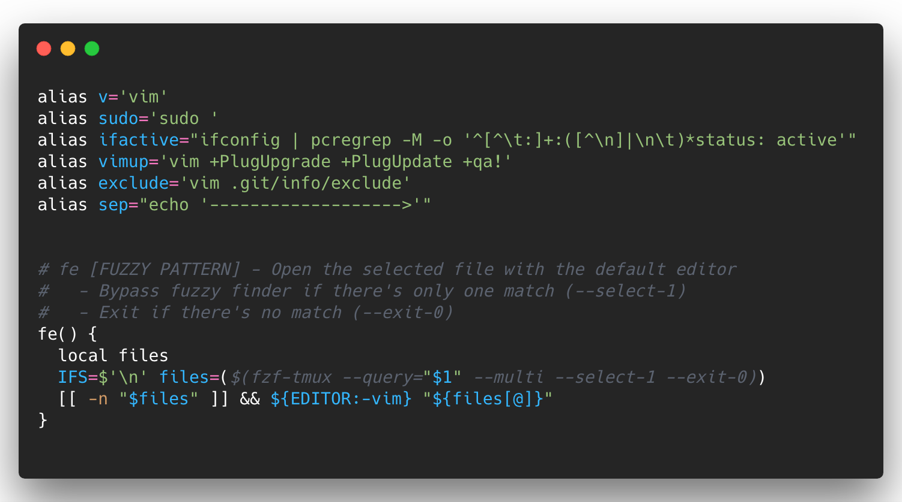

# 🦙 luhmann leverages lavish dotfiles



These are my dotfiles. Take what you want at your own risk.

## Installation

```bash
$ curl -O https://raw.githubusercontent.com/luhmann/dotfiles/master/run.bash
$ bash run.bash
```

## Features

-   download several fonts for programming/cli automatically
-   apply iTerm-settings from dotfiles automatically
-   install tools & applications automatically through `Brewfile`
-   apply osx defaults
-   setup vim
-   setup zsh
